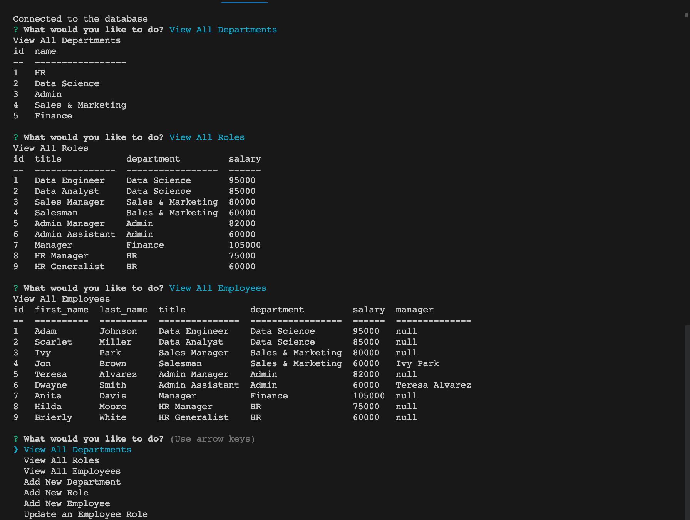

# User Story
AS A business owner
I WANT to be able to view and manage the departments, roles, and employees in my company
SO THAT I can organize and plan my business

## Acceptance Criteria
GIVEN a command-line application that accepts user input
WHEN I start the application
THEN I am presented with the following options: view all departments, view all roles, view all employees, add a department, add a role, add an employee, and update an employee role
WHEN I choose to view all departments
THEN I am presented with a formatted table showing department names and department ids
WHEN I choose to view all roles
THEN I am presented with the job title, role id, the department that role belongs to, and the salary for that role
WHEN I choose to view all employees
THEN I am presented with a formatted table showing employee data, including employee ids, first names, last names, job titles, departments, salaries, and managers that the employees report to
WHEN I choose to add a department
THEN I am prompted to enter the name of the department and that department is added to the database
WHEN I choose to add a role
THEN I am prompted to enter the name, salary, and department for the role and that role is added to the database
WHEN I choose to add an employee
THEN I am prompted to enter the employee’s first name, last name, role, and manager, and that employee is added to the database
WHEN I choose to update an employee role
THEN I am prompted to select an employee to update and their new role and this information is updated in the database

# Employee Tracker

## Description
  This is a command-line application built to manage a company's employee database using Node.js, Inquirer, and MySQL. It functions as a Content Management System for non-developers to easily view and interact with information stored in the database from the terminal.

## Table of Contents
  - [Installation](#installation)
  - [Usage](#usage)
  - [Credits](#credits)
  - [Features](#features)
  - [Tests](#tests)
  - [License](#license)

  ## Installation
  Clone the respository from the repo in GitHub. Make sure you install Node.js and NPM on your computer. You will need to install the node package manager (NPM) using `npm init` and then the inquirer v8.2.4 module using `npm i inquirer@8.2.4`. Use `npm install` to install required dependencies.

  ## Usage
  You can find the walkthrough video here - [employee tracker walkthrough video](https://drive.google.com/file/d/1vxcHDMJm1OJ5c01pVSzB7RfBjPI2XITW/view?usp=share_link)
  
  

  Start by opening the file in the terminal. Run `mysql -u root -p` to initialize MySQL, then type password to login. Type `source db/schema.sql` and `source db/seeds.sql` to load the database and then `quit`. Run `npm start` and then select an option from the menu prompt. Follow the prompts for each selection. Select `Exit` to quit the application. 

  

## Credits
npm mysql2 - https://www.npmjs.com/package/mysql2 
  

## Features
* Node.js
* NPM 
* NPM Inquirer
* Express.js
* MySQL2

## Tests 
N/A

## License
The project is licensed under MIT. For more information, please refer to the LICENSE in the repo.
  

